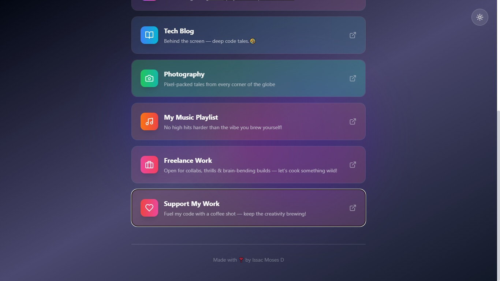
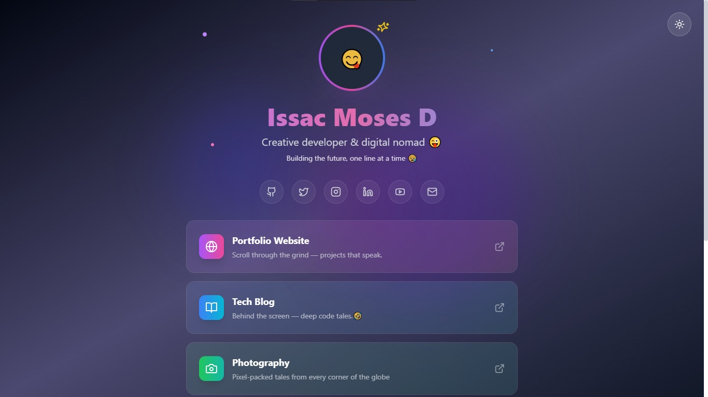

# ✨ Interactive LinkTree Template

<div align="center">
  


*A modern, animated linkTree with theme toggle and elegant UI*

[](https://github.com/yourusername/yourrepo)
[](https://github.com/yourusername/yourrepo/network/members)


</div>

## 🔗 Live Preview

🌐 [Visit My Website](https://issac-moses-linktree.netlify.app/)  
📁 [GitHub Repository](https://github.com/Issac-Moses/Linktree)

## 🎨 Features

- 🌓 **Dark/Light Mode Toggle** with localStorage persistence
- ✨ **Animated Gradient Background** with floating blobs
- 🃏 **Interactive Link Cards** with hover effects
- 🏃 **Smooth Animations** using CSS transitions
- 📱 **Fully Responsive** design
- 🌈 **Custom Gradient Effects** for each link
- 🧊 **Glassmorphism UI** elements

## 🛠️ Technologies

<p align="center">
  
</p>

## 🚀 Quick Start

1. **Clone the repository**
   ```bash
   git clone https://github.com/Issac-Moses/Linktree

2. **Install dependencies**
   ```bash
   npm install

3. **Run the development server**
   ```bash
   npm run dev
  
## 📸 Screenshots




> 💡 *Screenshots show the homepage with glowing profile, gradient buttons, and interactive link cards.*

## 🙋‍♂️ About Me

Hi! I'm **Issac Moses D**, a Third-year B.Tech student in **AI & Data Science**, passionate about building cool websites, automation tools, and creative content. I'm currently exploring frontend development and personal branding.

> "Building the future, one line at a time 😪"

---

## ☕ Support My Work

If you like what I do and want to support my creativity, feel free to [buy me a coffee](upi://pay?pa=6381256035@mbk&pn=Isaac%20Moses&cu=INR). Your support means a lot! ❤️

---

## 📬 Contact

- 📧 Email: your-email@example.com
- 🔗 Connect on [LinkedIn](https://www.linkedin.com/in/your-profile)
- 🐱 GitHub: [@issac-moses](https://github.com/Issac-Moses)

---

## 🏷️ License

This project is open-source and available under the [MIT License](LICENSE).
